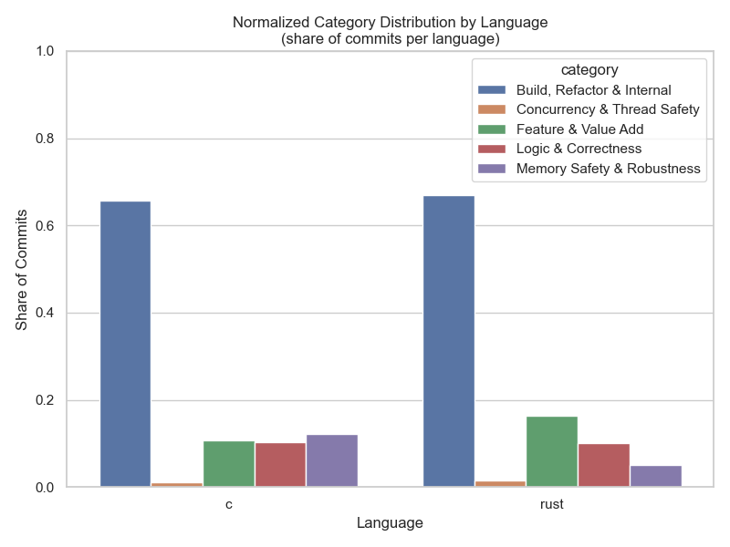
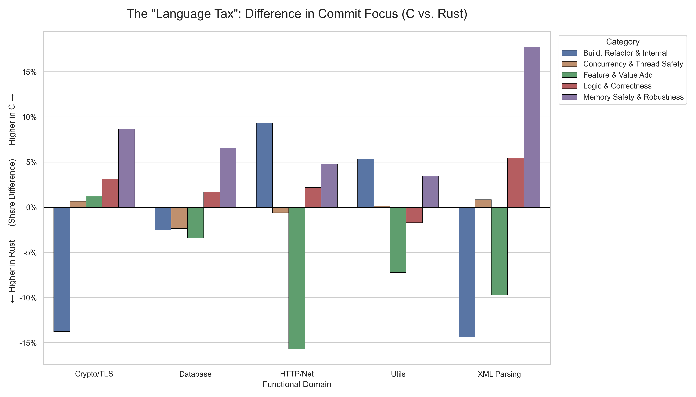
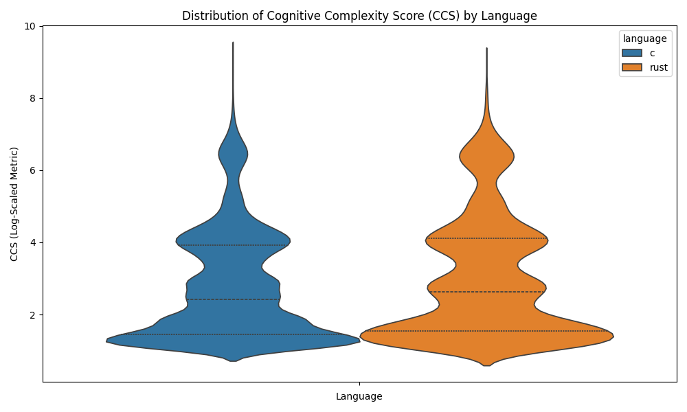

# C vs. Rust: Quantitative Maintenance Burden Analysis

> **Status:** Completed (Fall 2025)
| **Stack:** Python, C, Rust, Google Cloud Platform (Vertex AI, BigQuery), Gemini 2.0 Flash Lite
| **Focus:** MLOps, Static Analysis, Cloud FinOps, Statistical Research

## TL;DR
A large-scale comparative analysis of **182,746 commits** across 25 years of open-source history. This project quantifies the economic "maintenance burden" difference between C and Rust to inform critical infrastructure migration decisions.

**Key Result:** Demonstrated a **3x reduction** in memory-safety maintenance events when using Rust, proving that the language successfully "Shifts Left" complexity from the maintenance phase to the development phase.


*Overview: Distribution of maintenance categories across C and Rust projects.*

---

## 1. The Research Question
**Context:** This research was motivated by the real-world "maintainer crisis" in critical infrastructure, specifically regarding `libxml2`—a C-based XML parser used in billions of devices. The project aims to provide a data-driven answer to a strategic question: *Is it more efficient to source specialized C maintainers or migrate the codebase to Rust?*

**The Hypothesis:** 
*   **C** pays a *Runtime Tax*: High frequency of simple fixes for dangerous, unpredictable bugs (Segfaults).
*   **Rust** pays a *Compile-Time Tax*: High frequency of complex fixes required to satisfy the compiler, resulting in near-zero runtime memory bugs.

## 2. Methodology: "Apples-to-Apples"
To isolate programming language as the primary variable, I analyzed 5 matched pairs of libraries serving identical functions:

| Domain | C Representative | Rust Representative |
|:---|:---|:---|
| **XML Parsing** | `libxml2` | `quick-xml` |
| **HTTP/Networking** | `libcurl` | `hyper` |
| **Cryptography/TLS** | `openssl` | `rustls` |
| **Database** | `sqlite` | `limbo` |
| **System Utils** | `coreutils` (GNU) | `coreutils` (uutils) |

---

## 3. The Engineering Pipeline (MLOps)

I engineered a custom ETL pipeline to classify human intent from code diffs, addressing challenges in data quality and cloud scalability.

### A. The "Smart Truncation" Algorithm (The Accordion)
Raw git diffs are token-expensive. I wrote a custom parser using `unidiff` that:
1.  **Strips Artifacts:** Removes auto-generated files, assets, and lockfiles.
2.  **Compresses Context:** Keeps the "Head" and "Tail" of function changes while truncating the repetitive middle.
3.  **Result:** Reduced token usage by **60-90%**, preserving semantic context while maximizing throughput.

### B. The Classifier & Data Strategy
I fine-tuned **Gemini 2.0 Flash Lite** to classify commits into a custom taxonomy. 

*   **Synthetic Data Augmentation ("Booster Packs"):**
    Concurrency bugs are rare (<1% of commits). I generated synthetic examples to ensure the model could recognize deadlocks and race conditions despite their scarcity in raw logs.
*   **Chain-of-Thought Prompting ("Mini-Lessons"):**
    The model was required to generate a 15-word "Mini-Lesson" explaining the bug before outputting a label. This "show your work" approach significantly reduced hallucinations on complex systems code.
*   **Human-in-the-Loop (HITL) Curation:** 
    I manually verified and labeled a "Gold Standard" training dataset (240+ commits) to ensure the model learned from human-adjudicated intent.

### C. Cloud FinOps & Optimization
*   **Architecture:** Migrated from online inference to Vertex AI Batch Prediction.
*   **Result:** Processed the full dataset for **$64** (vs. a projected $500+).
*   **Impact:** **92% Cost Reduction** and 36x throughput increase.

---

## 4. Key Findings

### Finding 1: The "Memory Safety Gap"
*   **The 3x Difference:** C libraries consistently allocate **~12%** of maintenance effort to Memory Safety, while Rust libraries allocate only **~4%**.
*   **The Rust Dividend:** There is a near-perfect correlation: The effort saved by eliminating memory bugs in Rust is reinvested directly into **Feature & Value Add**.


*Figure 1: The "Language Tax" - Quantifying the trade-off between Memory Safety effort and Feature development.*

### Finding 2: The "Shift Left" Effect
I developed a **Commit Complexity Score (CCS)** to quantify effort:
$$CCS = (0.5 \cdot CogLoad) + (0.25 \cdot \log(Entropy)) + (0.25 \cdot \log(Churn))$$

*   **Interpretation:** Rust forces developers to resolve complexity upfront. C allows "simple" code to merge, but pays a massive "backend tax" in the maintenance phase.


*Figure 2: Distribution of Commit Complexity Scores (CCS) showing the Shift-Left effect in Rust.*

---

## 5. Acknowledgements & Consultations
*   **Domain Expertise:** Consulted with the Executive Director of the Internet Security Research Group (ISRG) on a monthly basis to refine project direction.

---

| Variable | Description | Type |
|:---|:---|:---|
| `language` | Programming language of the library (C or Rust). | Categorical |
| `commit_id` | Unique SHA-1 identifier for the commit. | String |
| `repo` | Name of the open-source library. | Categorical |
| `category` | The inferred intent (e.g., "Memory Safety", "Feature"). | Categorical |
|`is_security` |Is commit a security issue (bool). | 
|`is_feature` | Is commit a feature (bool). | 
| `complexity` | LLM-assessed cognitive load (1-5). | Integer |
| `reasoning` | Chain-of-thought mini-lessons.| Text |
| `entropy` | Number of files modified in the commit. | Integer |
| `churn` | Total lines added and removed. | Integer |
| `ccs_score` | Calculated Commit Complexity Score (derived metric). | Float |
| `year` | Year the commit was authored. | Integer |

## 6. Repository Structure

```bash
maintenance-burden-analysis/
├── etl_pipeline/              # Data Extraction & Preparation
│   ├── extract_commits.py     # GitPython extractor & "Accordion" truncation
│   ├── prepare_jsonl.py       # JSONL formatting for Vertex AI & synthetic data
│   └── upload_to_gcs.py       # Cloud Storage interface
├── training/                  # Model Fine-Tuning
│   ├── config.py              # Prompt configuration & model settings
│   ├── train_model.py         # Gemini model fine-tuning
│   ├── merge_datasets.py      # Merge gold standard & labeled data
│   └── add_synthetic_ids.py   # Generate synthetic training examples
├── analysis/                  # Evaluation & Visualization
│   ├── evaluate_model.py      # Model performance metrics
│   ├── generate_visuals.py    # Violin plots, bar charts, distributions
│   └── label_summary.py       # Taxonomy summary & validation
├── data/                      # Data Artifacts
│   ├── gold_standard/         # GOLD_VS_MODEL_COMPARISON.csv (HITL labeled data)
│   ├── results/               # Output CSVs (Complexity Scores, predictions)
│   └── samples/               # Sample datasets
├── docs/                      # Documentation
│   ├── images/                # PNG visualizations (8 charts)
│   └── Final_Report.pdf       # Full research report
├── .gitignore
├── requirements.txt
└── README.md
```

---

